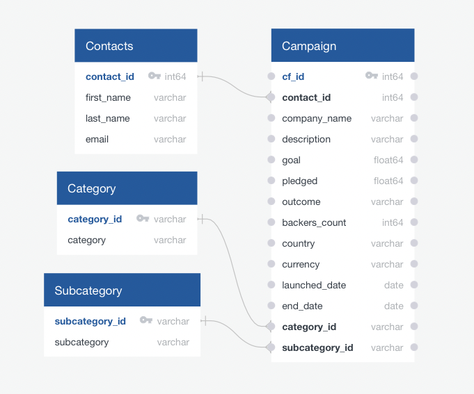

# Crowdfunding ETL - Group 3
Extract, clean and transform data from Excel files using Pandas for PostgreSQL database creation and loading!

Created and submitted as Group Project 2 for Monash University Data Analytics Boot Camp (August 2023).

## Table of Contents

- [General info](#general-info)
- [Technologies](#technologies)
- [Screenshot](#screenshot)
- [Code example](#code-example)
- [References](#references)

## General info

### ETL_Mini_Project_SPalframan.ipynb

- Extracts categories and subcategories from crowdfunding.xlsx. 
- Generates NumPy array and concatenates 'cat' or 'subcat' to array for use as keys in PostgreSQL Schema.
- Creates Pandas dataframes containing these data (cat/subcat_ids and cat/subcat names).  
- Exports dataframes as CSV files for PostgreSQL database loading.

### ETL_Mini_Project_AFadillah.ipynb

- placeholder. 
- placeholder. 
- placeholder. 
- placeholder. 

### ETL_Mini_Project_RGeeson.ipynb

- placeholder. 
- placeholder. 
- placeholder. 
- placeholder. 

### crowdfunding_db_schema.sql

- Creates Contacts, Category, Subcategory & Campaign Tables.
  - see ERD Screenshot below. 
- Facilitates import of CSV files generated from Python files described above into these Tables. 
- Displays contents of Tables using SQL `SELECT` statement. 

## Technologies

Project created and run using:

- Python 3.10.9
  - Pandas 1.5.3
  - NumPy 1.24.3
- pgAdmin 4 version 7.2
- QuickDatabaseDiagrams.com
- Visual Studio Code 1.79.2
- Jupyter Notebook 5.3.0

## Screenshot

#### Entity Relationship Diagram (ERD)

NOTE: Please see [Resources/Database_Screenshots] for screenshots of crowdfunding_db and tables.  



## Code example

```python
# Code Snippet from ETL_Mini_Project_SPalframan.ipynb
#################################################    

# Transform NumPy array to Pandas Series to convert data type to String 
cat_ids_srs = pd.Series(category_ids).astype(str)
scat_ids_srs = pd.Series(subcategory_ids).astype(str)

# Use a list comprehension to add "cat" to each category_id. 
cat_ids = ['cat' + category_id for category_id in cat_ids_srs]

# Use a list comprehension to add "subcat" to each subcategory_id.    
scat_ids = ['subcat' + scategory_id for scategory_id in scat_ids_srs]
```

## References

- Creating Pandas Dataframes using Lists and zip() function:
  - https://www.geeksforgeeks.org/create-a-pandas-dataframe-from-lists/

- Code, in general, was adapted from Monash University Data Analytics Boot Camp 2023 course learning material.

Created and written by Samuel Palframan, Rhiannyn Geeson & Akbar Fadillah - August 2023.
